# Travel & Accommodation Booking Platform

Travelio is a full-featured travel and accommodation booking web application. It allows users to browse destinations, search hotels, view hotel details, add rooms to a cart, complete bookings, manage their profile, and view booking history. The project also includes an admin dashboard for managing cities, hotels, and rooms.

The frontend is built with React, TypeScript, Vite, Material UI, React Router, Axios, Formik, Yup, i18next, and Storybook. It connects to a deployed Express backend API hosted on Render.

## Live Links

- Frontend (Vercel): https://travilio-ten.vercel.app
- Backend API: https://travel-and-accomodation-booking-backend.onrender.com/api
- Backend Swagger Docs: https://travel-and-accomodation-booking-backend.onrender.com/api-docs

## Project Documentation

- [Project Documentation PDF](docs/project-documentation.pdf)
- [Project Documentation HTML Source](docs/project-documentation.html)

## Project Management and Tracking

This project was planned and tracked using **Notion**. Notion was used to organize project tasks, track progress, document requirements, manage feature priorities, and keep notes about implementation decisions during development.

The development process followed the project requirements and focused on building reusable components that can be shared across different parts of the application, such as cards, forms, tables, dialogs, layout components, API helpers, and cart-related UI patterns.

Notion workspace: add your public Notion link here if available.

## Demo Accounts

Use these accounts to test the application:

| Role | Username | Password |
| --- | --- | --- |
| User | `user` | `user` |
| Admin | `admin` | `admin` |

## Screenshots

The screenshots below are the final project screenshots used for the README and project documentation. Files ending with `1` and `2` are continuation screenshots for the same page after scrolling down.

#### Authentication

| Login | Login Validation |
| --- | --- |
|  |  |

#### Home

| Hero and Search | Featured Deals |
| --- | --- |
|  | 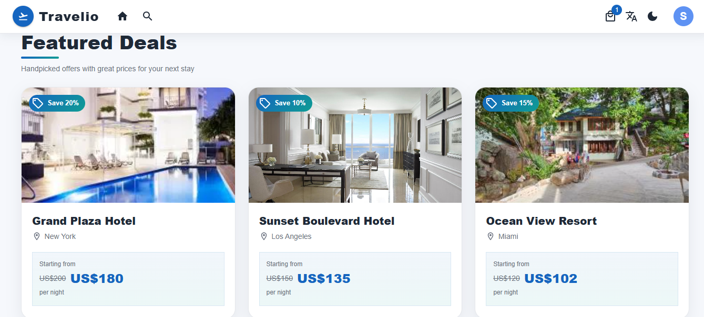 |

| Trending Destinations | Recently Visited |
| --- | --- |
| 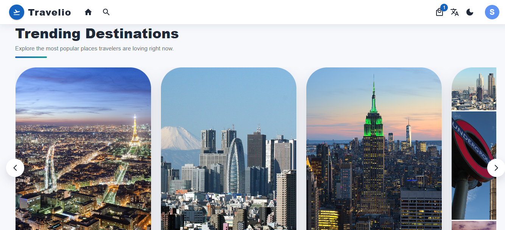 | 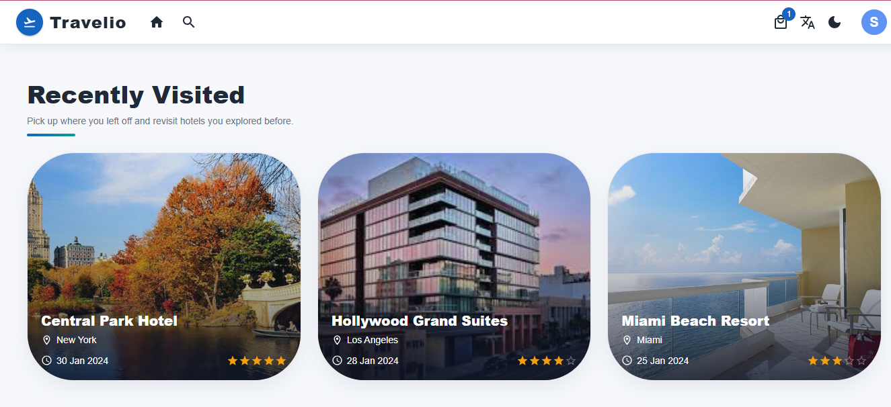 |

#### Search

| Search Results | Search Filters |
| --- | --- |
| 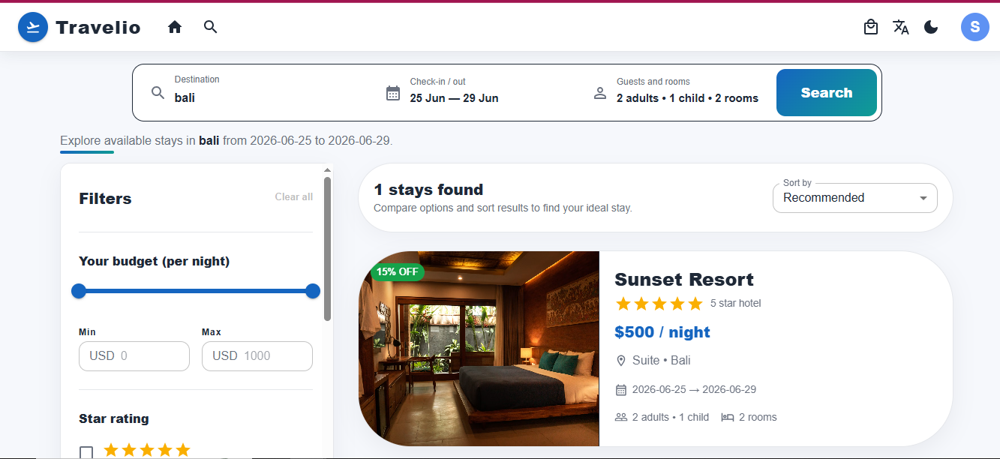 | 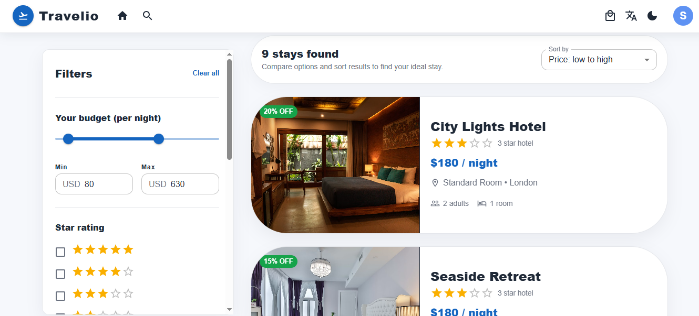 |

#### Hotel Details

| Hotel Details - Part 1 | Hotel Details - Part 2 |
| --- | --- |
| 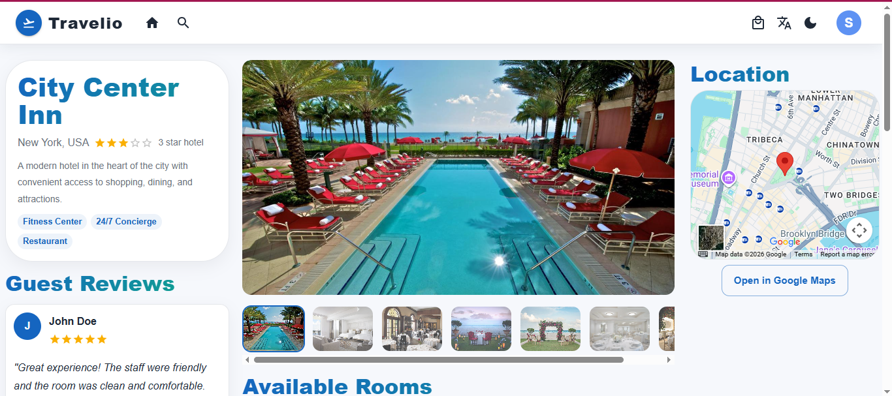 | 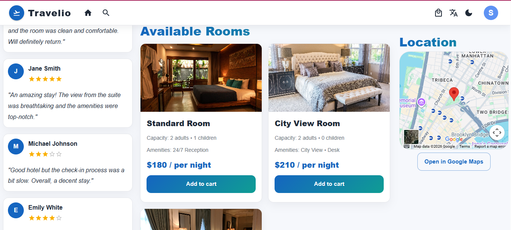 |

#### Booking Flow

| Empty Cart | Cart With Items |
| --- | --- |
| 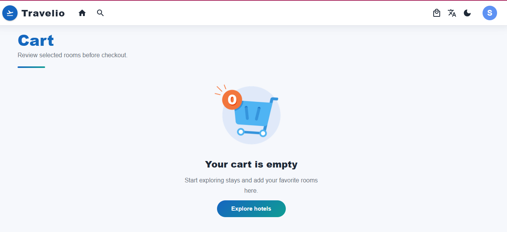 | 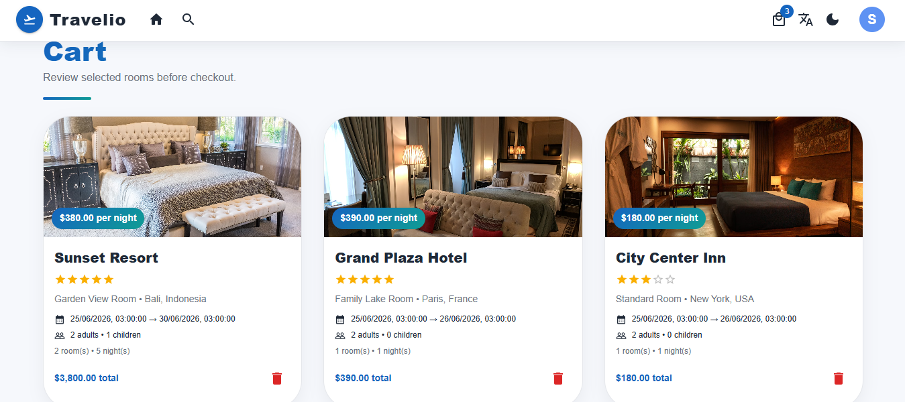 |

| Guest Info | Payment |
| --- | --- |
| 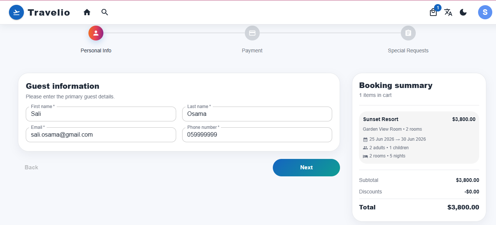 | 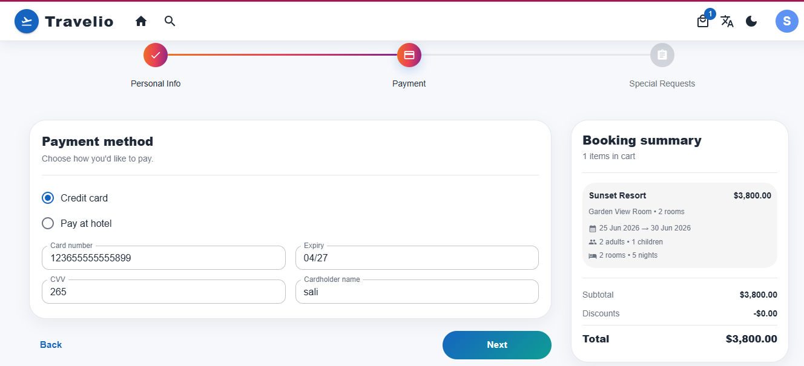 |

| Special Requests | Booking Confirmation - Part 1 |
| --- | --- |
| 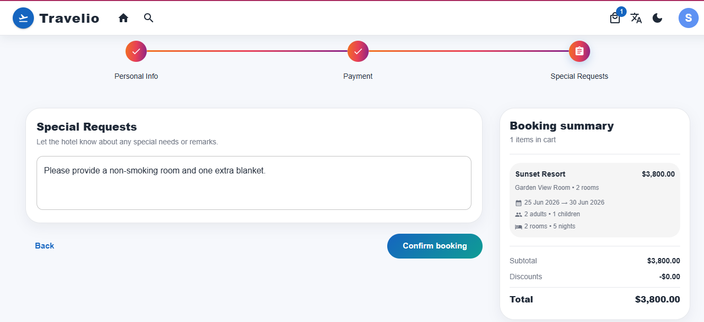 | 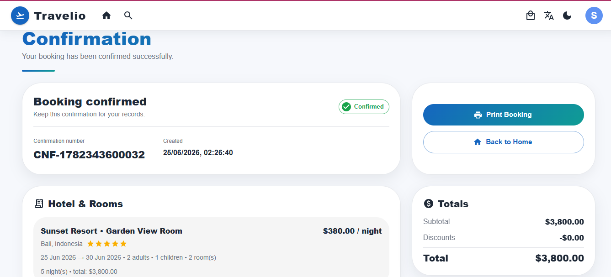 |

| Booking Confirmation - Part 2 |
| --- |
| 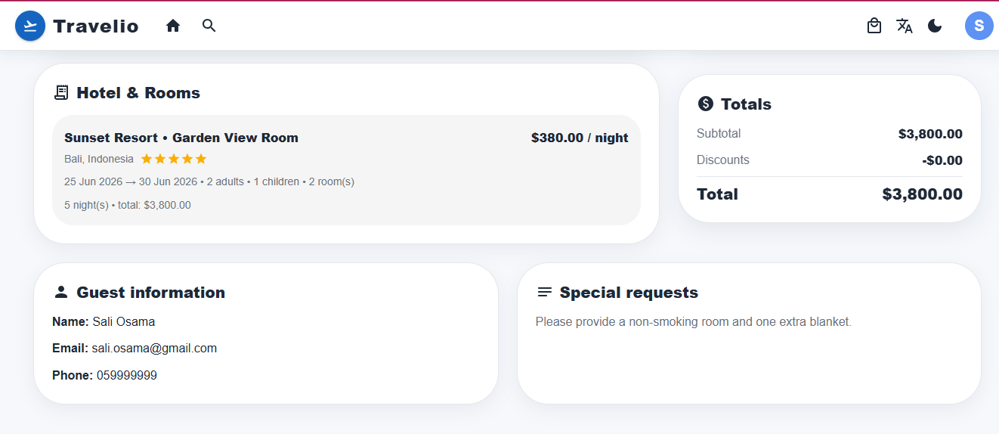 |

#### User Account

| Profile | My Bookings |
| --- | --- |
| 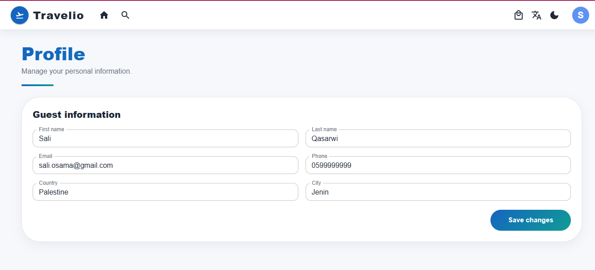 | 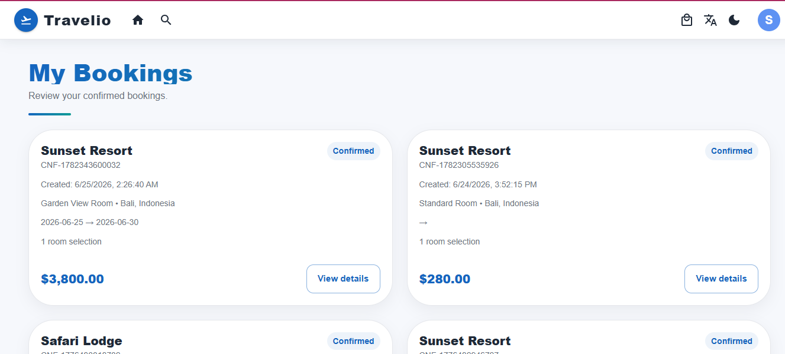 |

#### Language and Theme

| Arabic View - Part 1 | Arabic View - Part 2 |
| --- | --- |
|  | 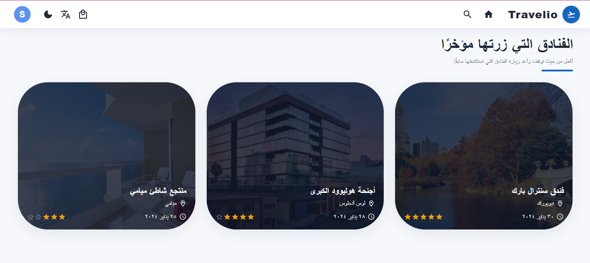 |

| Dark Theme |
| --- |
| 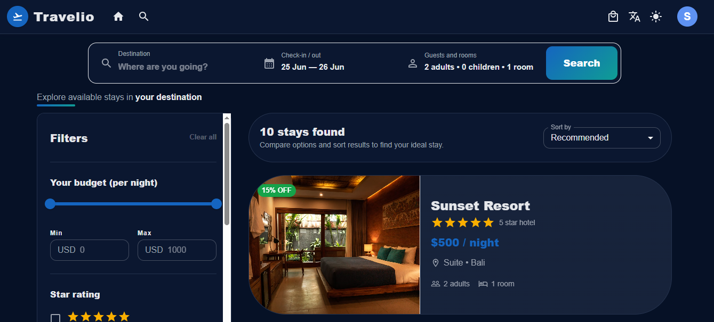 |

#### Admin Dashboard

| Admin Cities | Admin Hotels |
| --- | --- |
| 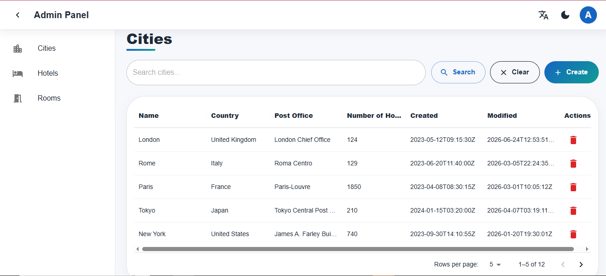 | 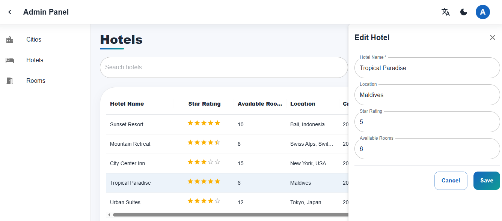 |

| Admin Rooms |
| --- |
| 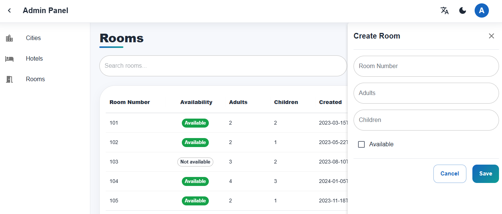 |

## Project Features

- User authentication with separate User and Admin roles.
- Protected routes for authenticated users.
- Admin-only dashboard routes.
- Hotel search by destination, dates, guests, and rooms.
- Search results with filtering and sorting.
- Hotel details page with gallery, information, rooms, reviews, and location section.
- Cart flow for selected rooms.
- Checkout flow with guest information, payment details, and special requests.
- Booking confirmation page.
- Profile page.
- My bookings page.
- Admin management pages for cities, hotels, and rooms.
- Arabic and English language support using i18next.
- Light and dark mode support.
- Form validation using Formik and Yup.
- Component stories using Storybook.
- Unit tests using Vitest and React Testing Library.

## Tech Stack

| Area | Technologies |
| --- | --- |
| Frontend | React 19, TypeScript, Vite |
| UI | Material UI, MUI X Data Grid, Emotion |
| Routing | React Router |
| API Client | Axios |
| Forms | Formik, Yup |
| Localization | i18next, react-i18next |
| Testing | Vitest, React Testing Library, Playwright browser provider |
| Component Docs | Storybook |
| Code Quality | ESLint, Prettier, Husky, lint-staged |
| Deployment | Vercel frontend, Render backend |

## Backend Integration

The frontend uses the environment variable `VITE_API_URL` as the backend base URL.

Create a `.env` file in the frontend project root:

```env
VITE_API_URL=https://travel-and-accomodation-booking-backend.onrender.com/api
```

The API client is configured in:

```txt
src/shared/api/config.ts
src/shared/api/httpClient.ts
```

The deployed backend provides endpoints such as:

```txt
POST /api/auth/authenticate
GET  /api/home/featured-deals
GET  /api/home/destinations/trending
GET  /api/home/search
GET  /api/hotels/:id
GET  /api/hotels/:id/gallery
GET  /api/hotels/:id/available-rooms
GET  /api/hotels/:id/reviews
POST /api/bookings
GET  /api/bookings
GET  /api/cities
GET  /api/rooms
```

## Getting Started

### Requirements

- Node.js
- npm

Check your versions:

```bash
node -v
npm -v
```

### Installation

Clone the repository:

```bash
git clone https://github.com/saliqasarwi/travel-and-accomodation-booking-platform.git
```

Navigate to the project folder:

```bash
cd travel-and-accomodation-booking-platform
```

Install dependencies:

```bash
npm install
```

Create the `.env` file:

```env
VITE_API_URL=https://travel-and-accomodation-booking-backend.onrender.com/api
```

Start the development server:

```bash
npm run dev
```

The app will run at:

```txt
http://localhost:5173
```

## Available Scripts

| Command | Description |
| --- | --- |
| `npm run dev` | Start the local Vite development server |
| `npm run build` | Build the production version |
| `npm run preview` | Preview the production build locally |
| `npm run lint` | Run ESLint checks |
| `npm run lint:fix` | Fix auto-fixable ESLint issues |
| `npm run format` | Format files with Prettier |
| `npm run format:check` | Check formatting without changing files |
| `npm run test` | Run Vitest in watch mode |
| `npm run test:run` | Run Vitest once |
| `npm run storybook` | Start Storybook |
| `npm run build-storybook` | Build Storybook |

## Project Structure

```txt
src/
  app/
    layout/
    providers/
    router/
  assets/
  features/
    admin/
    auth/
    bookings/
    cart/
    checkout/
    confirmation/
    home/
    hotel/
    profile/
    search/
  shared/
    api/
    components/
    i18n/
    theme/
    utils/
  styles/
```

The project follows a feature-based structure. Each major business area has its own pages, components, API layer, types, tests, and utilities when needed.

## Main Routes

| Route | Description |
| --- | --- |
| `/login` | Login page |
| `/` | Home page |
| `/search` | Hotel search results |
| `/hotels/:hotelId` | Hotel details |
| `/cart` | User cart |
| `/checkout` | Checkout flow |
| `/confirmation/:bookingId` | Booking confirmation |
| `/profile` | User profile |
| `/bookings` | User bookings |
| `/admin` | Admin dashboard |
| `/admin/cities` | Manage cities |
| `/admin/hotels` | Manage hotels |
| `/admin/rooms` | Manage rooms |

## Deployment

### Frontend Deployment on Vercel

Use these settings:

```txt
Framework Preset: Vite
Build Command: npm run build
Output Directory: dist
```

Add this environment variable in Vercel:

```txt
VITE_API_URL=https://travel-and-accomodation-booking-backend.onrender.com/api
```

After changing environment variables, redeploy the frontend.

### Backend Deployment on Render

The backend is deployed as a Render Web Service using:

```txt
Build Command: npm install
Start Command: npm start
```

The backend runs an Express API and serves Swagger documentation at:

```txt
/api-docs
```

## Testing

Run all tests once:

```bash
npm run test:run
```

Run tests in watch mode:

```bash
npm run test
```

Run Storybook:

```bash
npm run storybook
```

## Notes and Limitations

- The current backend uses JSON files as a simple data source.
- JSON file storage is suitable for demos and coursework, but a production application should use a real database such as PostgreSQL, MongoDB, Supabase, or another managed database.
- The deployed Render free service may sleep after inactivity, so the first request can be slower.
- The frontend requires `VITE_API_URL` to be configured correctly before deployment.
## Author

Developed by Sali Qasarwi.
